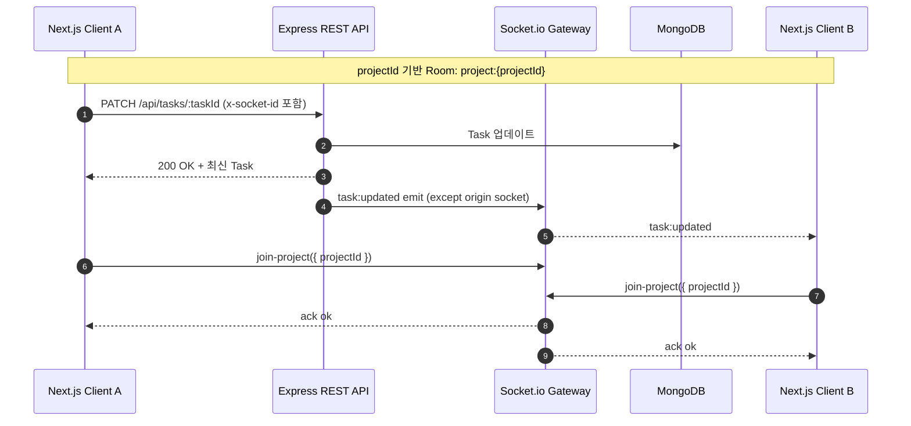

# AI 기반 실시간 협업 칸반 시스템

> Next.js + Express + MongoDB + Socket.io 기반으로 **프로젝트 단위 실시간 협업**을 구현하고, AI 기반 작업 추천/분해 흐름을 UI/데이터 모델에 통합한 팀 협업 칸반 프로젝트입니다.

---

## 1) 프로젝트 소개

### 프로젝트 목적
- 팀 단위 프로젝트에서 `업무 생성 → 진행 상태 공유 → 커뮤니케이션`이 분리되어 생기는 컨텍스트 손실을 줄이는 것이 목표입니다.
- 하나의 프로젝트 보드 안에서 태스크와 채팅을 함께 관리하고, 변경 사항을 즉시 동기화하도록 설계했습니다.

### 해결하려는 문제
- 협업 시 보드 상태가 사용자마다 달라지는 동기화 지연 문제
- 프로젝트 멤버 초대/수락 과정의 수동 관리 문제
- 작업을 처음 쪼개는 단계에서의 생산성 저하

### 왜 WebSocket / AI 기능을 사용했는가
- **WebSocket(Socket.io)**: 태스크 생성/수정/이동/삭제, 채팅 메시지를 프로젝트 참여자에게 즉시 전파해 동시 협업성을 확보합니다.
- **AI 기능**: 칸반 보드에서 AI 추천 작업 생성 UX를 제공하고, 백엔드에 OpenAI 서비스 레이어를 분리해 향후 Task Decomposition 연동 지점을 명확히 두었습니다.

---

## 2) 주요 기능

- **프로젝트 CRUD(핵심은 생성/조회/멤버 관리)**
  - 프로젝트 생성, 목록 조회, 단건 조회, 멤버 조회/제거
- **태스크 CRUD + 이동**
  - 프로젝트별 태스크 생성/조회/수정/삭제
  - 칼럼 이동(`todo`, `in-progress`, `done`)과 정렬 순서(`order`) 갱신
- **프로젝트 초대 기능**
  - 이메일 기반 초대 생성, 초대 목록 조회, 수락/거절
- **실시간 채팅**
  - 프로젝트 채팅 조회/전송 및 `chat:message` 이벤트 브로드캐스트
- **실시간 상태 동기화**
  - `task:created`, `task:updated`, `task:deleted`, `task:moved` 이벤트 동기화
  - `x-socket-id` 헤더 기반 자기 자신 중복 반영 방지
- **칸반 보드 상태 관리**
  - 프로젝트 Room 입장 후 소켓 이벤트 기반 클라이언트 상태 업데이트
- **OpenAI API 기반 Task Decomposition 확장 지점**
  - OpenAI 서비스 레이어가 분리되어 있으며(현재 미구현), 프론트는 AI 추천 작업 추가 UX를 제공

---

## 3) 기술 스택

- **Frontend**: Next.js(App Router), React, TypeScript, Tailwind CSS
- **Backend**: Node.js, Express, Mongoose
- **Database**: MongoDB
- **Realtime**: Socket.io (Server/Client)
- **AI**: OpenAI API 연동을 위한 서비스 레이어(`OPENAI_API_KEY` 환경변수, 서비스 스텁)
- **Deployment**: 저장소 내 배포 스크립트/인프라 구성은 확인되지 않음

---

## 4) 시스템 아키텍처

```mermaid
flowchart LR
  C[Next.js Client]
  R[Express Server\nREST API]
  S[Socket.io Gateway]
  DB[(MongoDB)]
  O[OpenAI API]

  C -->|HTTP/JSON| R
  C <-->|Socket Event| S
  R --> DB
  S --> DB
  R -->|AI 요청(확장 지점)| O

  subgraph Models
    P[Project]
    T[Task]
    M[Member(User)]
    MSG[Message(ChatMessage)]
  end

  DB --- P
  DB --- T
  DB --- M
  DB --- MSG
```



---

## 5) 프로젝트 구조

```text
frontend/
  app/                  # 라우팅(로그인, 대시보드, 프로젝트 보드 등)
  components/
    kanban/             # 칸반 보드, 채팅 패널, 태스크 모달/카드, 보드 상태 훅
    dashboard/          # 대시보드/초대 패널 UI
    projects/           # 프로젝트 생성 폼
  lib/
    api/                # 인증/프로젝트/태스크/채팅/초대 API 클라이언트
    socket/             # socket.io 클라이언트 연결/재사용

backend/src/
  routes/               # 도메인별 REST 라우트 정의
  controllers/          # 인증/프로젝트/태스크/채팅/초대 비즈니스 로직
  models/               # Project/Task/User/ChatMessage/ProjectInvitation 스키마
  sockets/              # socket 인증 및 join/leave Room 핸들러
  services/             # OpenAI 연동 서비스 레이어(현재 스텁)
  middlewares/          # JWT 인증 미들웨어
  utils/                # 토큰/암호화/프로젝트 접근 권한 유틸
```

---

## 6) 핵심 기능 흐름

### 6-1. 프로젝트 생성 흐름
1. 프론트 `ProjectCreateForm`에서 이름/설명 입력
2. `POST /api/projects` 호출
3. 서버가 `createdBy`, `members`, `memberCount`를 포함해 저장
4. 생성 후 보드 페이지로 라우팅

### 6-2. 태스크 생성/수정 흐름
1. 클라이언트가 태스크 API 호출(생성/수정/이동/삭제)
2. 서버가 프로젝트 접근 권한 검증 후 DB 반영
3. 응답 반환 + 동일 project Room에 task 이벤트 emit
4. 각 클라이언트가 이벤트를 받아 로컬 상태를 갱신

### 6-3. Socket.io 기반 실시간 동기화 흐름
1. 보드 진입 시 토큰으로 소켓 연결
2. `join-project`로 `project:{projectId}` Room 참가
3. 서버 emit 이벤트를 Room 단위로 수신
4. 화면 단에서 task map/column 배열 동기화

### 6-4. OpenAI Task Decomposition 흐름
1. UI에서 AI 작업 추가 트리거 제공
2. 현재는 샘플 추천 작업을 생성하는 형태로 동작
3. 백엔드 `openai.service.js`가 향후 실제 OpenAI API 호출 지점

### 6-5. 프로젝트 초대 및 협업 흐름
1. 프로젝트 소유자가 이메일로 초대 생성
2. 초대받은 사용자가 pending 초대 목록 조회
3. 수락 시 프로젝트 `members`에 추가, 거절 시 상태만 변경

---

## 7) 데이터 모델 요약

- **Project**
  - 프로젝트 메타 정보, 소유자(`createdBy`), 참여자(`members`)를 관리
- **Task**
  - 프로젝트별 작업 단위. 칼럼(`columnId`)과 순서(`order`)로 칸반 상태 표현
- **User(Member)**
  - 인증 주체. 프로젝트 멤버/초대/채팅 발신자 관계의 기준 엔터티
- **Message(ChatMessage)**
  - 프로젝트 채팅 로그. `project`-`sender` 참조로 협업 대화 기록

관계 요약:
- `Project 1 - N Task`
- `Project 1 - N ChatMessage`
- `User N - N Project`(members 배열 기반)
- `ProjectInvitation`이 `Project`와 `User(inviter/invitee)`를 연결

---

## 8) API 구조 요약

### 인증
- `POST /api/auth/register`
- `POST /api/auth/login`
- `GET /api/auth/me`

```json
// POST /api/auth/login (request)
{ "email": "user@example.com", "password": "******" }
```

```json
// 성공 응답 예시
{ "success": true, "data": { "token": "...", "user": { "id": "...", "name": "...", "email": "...", "role": "user" } } }
```

### 프로젝트
- `GET /api/projects`
- `POST /api/projects`
- `GET /api/projects/:projectId`
- `GET /api/projects/:projectId/members`
- `DELETE /api/projects/:projectId/members/:userId`

### 태스크
- `GET /api/projects/:projectId/tasks`
- `POST /api/projects/:projectId/tasks`
- `PATCH /api/tasks/:taskId`
- `DELETE /api/tasks/:taskId`
- `PATCH /api/tasks/:taskId/move`

### 채팅
- `GET /api/projects/:projectId/messages?limit=50`
- `POST /api/projects/:projectId/messages`

### 초대
- `POST /api/projects/:projectId/invitations`
- `GET /api/invitations/me`
- `PATCH /api/invitations/:invitationId/accept`
- `PATCH /api/invitations/:invitationId/decline`

---

## 9) 실시간 처리 구조

### Socket.io Room 기반 구조
- Room 이름 규칙: `project:{projectId}`
- 권한 확인 후에만 `join-project` 허용

### join / leave 흐름
- 보드 진입: `join-project`
- 보드 이탈/언마운트: `leave-project` + 소켓 이벤트 리스너 해제

### 이벤트 브로드캐스트 방식
- 태스크: 서버 컨트롤러에서 Room으로 이벤트 emit
- 채팅: 메시지 저장 후 Room으로 `chat:message` emit

### 상태 동기화 방식
- 초기 상태는 REST로 로드
- 이후 변경분은 Socket 이벤트로 반영

### 메시지/이벤트 중복 처리
- REST 요청 시 `x-socket-id`를 전송
- 서버는 해당 소켓을 `except` 처리하여 자기 자신에게 중복 브로드캐스트를 피함

---

## 10) 트러블슈팅(구현 기반)

- **실시간 이벤트 중복 반영 문제**
  - 원인: REST 응답으로 이미 반영한 변경이 Socket 이벤트로 다시 들어옴
  - 대응: `x-socket-id` 헤더 + `io.to(room).except(originSocketId).emit(...)`

- **REST API + WebSocket 혼합 구조 설계**
  - 전략: 쓰기의 정합성은 REST, 전파는 Socket으로 역할 분리

- **상태 동기화 문제**
  - 전략: 첫 로딩은 REST 전체 조회, 이후는 이벤트 증분 반영

- **프로젝트 단위 Room 분리**
  - 전략: `projectId` 네임스페이스 룸으로 격리하여 타 프로젝트 이벤트 노출 방지

- **Socket 재연결 처리**
  - 현재 구조: 클라이언트에서 소켓 인스턴스를 재사용하고 보드 lifecycle에 따라 connect/disconnect 수행
  - 별도 백오프/재시도 정책은 코드상 명시되어 있지 않음

---

## 11) 실행 방법

### 사전 준비
- Node.js 18+
- MongoDB 인스턴스

### Backend 실행
```bash
cd backend
npm install
npm run dev
```

### Frontend 실행
```bash
cd frontend
npm install
npm run dev
```

### 환경 변수 예시

#### backend/.env
```bash
PORT=4000
MONGODB_URI=mongodb://127.0.0.1:27017/capstone_design
JWT_SECRET=your_jwt_secret
CLIENT_URL=http://localhost:3000
OPENAI_API_KEY=your_openai_api_key
SKIP_DB=false
```

#### frontend/.env.local
```bash
NEXT_PUBLIC_API_BASE_URL=http://localhost:4000
```

### MongoDB 연결
- 백엔드는 시작 시 `MONGODB_URI`로 MongoDB 연결을 시도합니다.
- 로컬 실행 시 `mongodb://127.0.0.1:27017/<db_name>` 형태를 사용하면 됩니다.

---

## 12) 배운 점 / 개선 방향

### 배운 점
- Socket.io Room 단위 설계로 프로젝트별 이벤트 경계를 명확히 분리
- REST + 실시간 이벤트를 혼합해 정합성과 반응성을 동시에 확보
- 협업 시스템에서 권한 검증(프로젝트 접근 제어)이 데이터 흐름의 핵심임을 확인

### 개선 방향
- OpenAI 서비스 레이어를 실제 Task Decomposition API로 연결
- JWT 만료/갱신(Refresh Token) 전략 고도화
- Redis Adapter 도입으로 다중 서버 Socket 확장
- Docker 기반 실행/배포 표준화

---

## 참고 문서
- `docs/project-structure.md`
- `docs/socketio-setup.md`
- `backend/README.md`
- `frontend/README.md`
